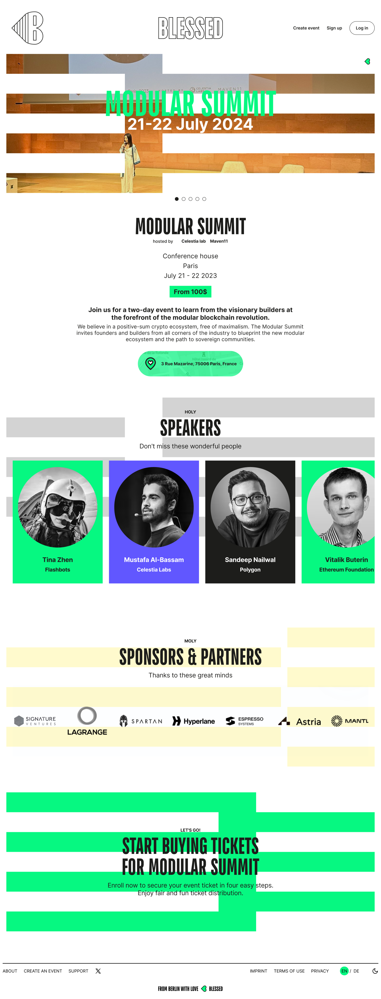

# UX of the Blessed solution
Our submission for the UX competition at the Celestia's Infinite Space Bazaar Hackathon


---

# Blessed UX Solution

Welcome to the UX presentation page for our innovative UX solution around our project "Blessed".

## Table of Contents

1. [Introduction](#introduction)
2. [UX Challenges](#Our-UX-Challenges)
3. [Problem Statement and Ideation](#ProblemStatement-and-Ideation-Process) 
4. [Main Fuctionality](#Main-Functionality)
5. [Stylescape](#Stylescape)
6. [Colors](#Colors)
7. [Icons usage in our UX Design](#Icons-usage-in-our-UX-Design)
8. [Typography TT Bluescreens & Inter](#Typography-TT-Bluescreens-&-Inter)
9. [Logo Design BLESSED](#Logo-Design-BLESSED)
11. [Webseite](#Website)
12. [Mobile](#Mobile)
13. [Animation](#Animation)
14. [Related Links](#Related-further-Links)
    


## Introduction

Our mission is to add a user experience (UX) that has the capability to onboard masses. 


With "Blessed", we've crafted a solution that is intuitive, effective, and visually captivating. We considered the challenges users face when waiting in virtual queues for oversubscribed events. Our goal was to make this process more engaging and enjoyable while ensuring a fair and transparent distribution model for such events. Our solution strikes for the perfect balance, transforming waiting times into enjoyable experiences while making ticketing fair und transparent.   

## Our UX Challenges

We encountered several significant UX challenges in our project, focusing on two primary areas: the ticketing process and the underlying infrastructure.

#### Ticketing Process
One of our main objectives was to reimagine the ticketing experience for oversubscribed events. Key questions we addressed included:

- **Enhancing the User Experience:** How can we transform the frustrating process of buying tickets into an enjoyable experience?
- **Fairness:** How can we ensure the ticketing process is fair and transparent for all users?
- **Engagement:** What strategies can we use to activate and engage future event attendees?

#### Infrastructure and Onboarding
The second area of focus was the infrastructure supporting our platform. We aimed to leverage Gelato.Network's RaaS, their middleware like VRF and relayer services, and third-party integrations such as Thirdweb. Our goals were:

- **User-Friendly Onboarding:** How can we make the onboarding process intuitive and accessible to a wide audience, minimizing technical restrictions?
- **Wallet Creation:** How can we simplify the process for users to create and manage digital wallets?
- **Transaction Fees:** How can we educate users about potential transaction fees and streamline the process of obtaining necessary tokens?
- **Technical Barriers:** What measures can we implement to reduce technical barriers and make the infrastructure more approachable for non-technical users?

By addressing these challenges, we aimed to create a  fair, and user-friendly experience for all our users, ensuring accessibility and engagement across all phases.


## Problem Statement and Ideation Process

The goal of our project is to create a enjoyfull experience for users transitioning between exploring events related background information and purchasing tickets. 
This objective serves as a foundational framework to guide all subsequent decisions:

```
“Make switching between exploring event details and buying a ticket feel intuitive and smooth.”
```
This guiding principle has led us to explore various ideas aimed at entertaining and engaging the user, such as:  


During Waiting Periods we have our Entertainment and Information Slider: An interactive window featuring an entertainment and information slider to keep users engaged while they wait.  


“Take a Break” Switch: A switch that transforms the slider content into a "Back to Lottery / Auction" view, supported by a vertical switch flip animation for a smooth transition between the slider and lottery areas.  

Cooldown Phase Countdown: A countdown timer with color coding in "BLESSED Chill Blue" to indicate cooldown phases, providing users with a clear visual cue for breaks. 
  


Visualizing the Four Main Phases:  
We employ a running down time metaphor in the bars representing the four phases of our product's main functionality.  
Active and Remaining Time: Represented by the active color "Harmony Green."  
Passed Time: Indicated by turning the bar grey in "Whispering Fog."  
These features are designed to create an intuitive and engaging user experience, ensuring that every aspect of the interface aligns with our overarching goal.  


**Technical approach:**
- Step I - Wallet creation by Thirdweb - means any user can create a wallet in the back by using thei e-mail, Google, Apple or Facebook account. Any crypto native can sign in with their existing wallet. We did not design the Login UI as we used the free for the hackathon UI from Thirdweb for that. 
- Step II - Paying Gas to do any form of transaction is the next UX challenge to onboard non crypto natives. Here we used Gelatos Relayer option and Thirdwebs account abstraction. 
- Step III - Bundling transactions - as we create various contracts per event they needed to be deployed by the creator of the event. We used OpenZepplins Clone function e.g. to bundle these into a single transaction, that is executed now when the event creator clicks the create event button. 

### Main Functionalities

We have an "Enroll" area docked to the event detail pages, which opens as soon as the user initiates the enrollment process. Within the opened "Enroll" area, the user will see the main ticket purchasing section, which can be collapsed by clicking an arrow icon.


When closed, this area displays information about the remaining time of the lottery or auction phase. We have four phases: Lottery 1, Lottery 2, Auction 1, and Auction 2. Following these phases, there is a Marketplace where users can resell their tickets. (not in the scope of the hackathon)

The "Enroll" area is divided into two parts:


Left Side: The deposit and cart area.  
Right Side: Occupying more than two-thirds of the space, this is the main part of the interactive window. It contains an interactive timeline showing the duration of each phase. At the top of this section, there is information about the entire ticket purchasing process for the event, including its end time.
Below the phases timeline, there are boxes with information and interactions specific to each phase. For example, in Lottery 2, users can add more money to generate numbers, increasing their chances of winning. To make this action more engaging and exciting, the highlight color orange is used for the button.

Notifications appear on the right sidebar within the interactive window area.   
These notifications inform the user about:

Cooldown Phase Start: Color-coded as Chill Blue.  
Boost Phase Activation: Color-coded as Vibrant Orange.  
Friendly Reminders: To generate a new number, also in Vibrant Orange.  
Win Notification: Color-coded as Mystic Berry, accompanied by a micro-animation with confetti, drawing attention to the cart/deposit/mint area on the left.  


## Stylescape

We created a Stylescape as point of reference to establish the overall look and feel for the BLESSED Experience Design Language. Think of Styelscapes as moodboards taken to the next level which shows a few samples of what the final design could look like. They help us agree on the design direction and visual interaction elements before designing anything. It’s not just about creating modular design materials—it’s also about creating a lifestyle ecosystem as well.


## Guiding Users
In designing our product, we aimed to balance the needs of new users with those of experienced ones. We introduced features like a floating "How it Works" button at the bottom right corner of the screen. This button is available to all users, providing guidance without disrupting the experience for those already familiar with the system.

To maintain a consistent and intuitive user experience, we use a color-coding system:

```Support and Hints: Items related to support and hints are highlighted with the color "Mystic Berry." ```   
```Background Elements: These items are set against a background color of "Sunny Whisper."```

This approach ensures that both new and experienced users can easily find the help they need without feeling overwhelmed or patronized.



Labeling and Terminology
For the phases, we are considering making them more engaging and human by using names like  Random Raffle or Lucky Draw instead of Lottery I e.g. Same is the case for lottery II (Lucky Slot
& Lucky Roll) and Auctioin I (Bid Rounds e.g.) and for Auction II (Rank Auction e.g.)

Tone of Voice
The tone of voice of our app is modern and entertaining, while also being guiding, transparent, and professional. This ensures that users feel supported and informed throughout their experience, enhancing both usability and enjoyment.


## Colors

In our UX design, we apply the 60-30-10 rule to ensure a balanced and harmonious color scheme. **60%** of the visual space is dominated by our primary colors: **Harmony Green**, complemented by **Whispering Fog** and **Lunar Glow**, creating a calm and neutral backdrop. 


*Blessed colors*


**30%** is allocated to **Mystic Berry** and **Eclipse Black**, used on interactive elements like buttons and links to draw attention and enhance user engagement, such as minting after winning a ticket.   


*Blessed colors*

The remaining **10%** features **Vibrant Orange** for critical interactions and alerts, alongside **Sunny Whisper** paired with **Mystic Berry** to guide and inform the user. This ensures these elements catch the user’s eye and reinforce the overall usability and aesthetic of the design.

Eclipse Black (Behind general modals): 
Chosen for its sophistication and depth, Eclipse Black creates a neutral, unobtrusive backdrop that helps general modals stand out without distraction. This color minimizes visual strain and keeps the user focused on the modal content.  


Mystic Berry (Behind “How it works” modals): This color is used to draw attention and invoke curiosity. Mystic Berry’s vibrant and enchanting qualities make it ideal for "How it works" modals, where engaging the user and providing clear, intriguing information is key.


Sunny Whisper (Yellow, Before the first lottery starts): Sunny Whisper is used for its warm and optimistic connotations. Before the first lottery begins, this pale yellow communicates a sense of anticipation and possibility, encouraging users to feel positive and hopeful about the upcoming event.


Harmony Green (While the lottery/auction phases are running/active): Harmony Green signifies growth, balance, and renewal. Using this color while the lottery or auction is active promotes a sense of calm and steady progress. It reassures users that the process is ongoing and stable, which is crucial for maintaining trust and engagement during these phases.


Sky Blue (In cooldown phases): Selected for its cool, calming effects, Sky Blue represents tranquility and a relaxed pace. During cooldown phases, this color helps communicate a period of rest or lower activity, encouraging users to reflect and prepare for the next active phase without feeling rushed.
 


This color strategy is designed to leverage the psychological effects and symbolic associations of each color to create a user-friendly, intuitive interface that aligns with the different states and phases of our application, enhancing the overall user experience.


## Icons usage in our UX Design 

For our user interface elements, we primarily utilize the **SHARP Line** icon set. These icons are characterized by their geometric and high-tech appearance, which contributes to a modern, bold, and professional look. 


The SHARP Line icons stand out due to their brutalist style, featuring sharp angles and a mix of squares and circles. This design provides a distinctive and strong visual identity that is simple yet effective. Unlike the more common rounded icons, the SHARP Line offers a unique voice and clear legibility, making them an excellent choice for projects that require a serious and impactful yet welcoming and approachable tone.


For larger, more illustrative uses, we opt for the **SHARP Duo** icon set. This variant brings versatility and color into our designs without overwhelming detail. The SHARP Duo icons are notable for their customizable line width and dual-color design, allowing for creative and vibrant presentations. We often scale these icons to larger sizes to serve as illustrative graphic elements, enhancing the visual interest and user engagement throughout our application.


## Typography TT Bluescreens & Inter

Our corporate typography leverages TT Bluescreens, a geometric sans serif with narrow proportions that offers a clean and modern look. The font is characterized by its memorable yet neutral character.

In addition to TT Bluescreens, we use Inter, a highly readable sans serif from Google Fonts, primarily for body text to complement the headings and ensure clarity and coherence in our interface typography.

## Logo Design BLESSED
The logo for BLESSED features a unique pictorial mark: a heart rotated by 90 degrees to resemble a capital letter 'B'. The right side of the heart forms the right side of the 'B', while the left side extends into repeating lines that create a perspective view of the backsides of a 'B'. 


This inventive and modular design is paired with a word mark “BLESSED” in capital letters using the TT Bluescreens font. This combination ensures that our logo is not only distinctive and impactful but also aligns seamlessly with our overall brand identity, utilizing the strength and character of our corporate fonts.  

## Website

**Innovative Filter System**

Navigating a plethora of events and concerts surrounding a main conference can be overwhelming for users.   
Our innovative filter system is designed to provide clarity and guidance, making it easy for users to find what they're looking for.

**Guiding Users Through Our Design**

We use thoughtfully crafted design elements to guide users through our homepage.   
The prominent filter system is a key component in offering personalized guidance.


#### Key Filter Options

- **What**: Users can specify their preferences or choose a combination of Conferences, Events, or Concerts. This helps them narrow down the options to what truly interests them.

- **Where**: Users can define the timeframe they have available for these activities. This ensures they can plan their schedule efficiently around the main conference or event.

- **When**: Users can select their preferred locations. We use cities as the primary filter, as users typically know where they are going and when.

- **Who**: This filter is perfect for those who want to follow specific experts. Users can find events featuring their favorite speakers or performers, enhancing their overall experience.

By leveraging these filters, our system transforms a potentially overwhelming array of options into a tailored, user-friendly experience. 


**Event Page Design**

When a user navigates to an event page, we aim to provide a clean and intuitive design with our signature elements. Our goal is to offer ample space for browsing event details while ensuring that users can easily see any ongoing sales and interact with them at any time.

**Clean and Spacious Layout**

We designed the event page to give users plenty of room to explore event details. This clean layout ensures that all the essential information is easily accessible without feeling cluttered.

**Interactive Window**

Our interactive window is a key feature that enhances user engagement. It offers everything needed to seamlessly purchase tickets while providing an option for entertainment. Users can switch to the other side of the interactive window for a more engaging experience at any time.

**Key Elements of the Event Page**

- **Event Details**: Clear and concise presentation of event information, including date, time, location, and descriptions.
  
- **Ongoing Sales**: Visibility of any ongoing sales or promotions, allowing users to take advantage of offers without missing out.
  
- **Interactive Window**: A playful and engaging feature where users can:
  - Purchase tickets easily.
  - Flip to the other side for additional entertainment options.

By combining a spacious layout with interactive features, our event page ensures users have a seamless and enjoyable experience while accessing all the information and tools they need.
<video src="Animation/BLESSED_SFX_4K.mp4" controls="controls" style="max-width: 730px;">
</video>




## Animation

An animation that demonstrates the functionality of our solution    
Here we spen tons of time going back and forth and we are stikll not finished but like to show the first results and how we got there.
  

Then we developed the visula elements 


The first result of ths is our branding intro animation.  
https://bit.ly/blessedfan

## Mobile
Here you a first gist how the look and feel will be when we have Mobile ready.  

  

  


## Related further Links
Here we list all relevant other repos.

## APP 

We create a dedicated repo for the APP to you understand the database structure and how to set it up.
https://github.com/BlessedOrg/swifty-app  


## Gelato Bounty 

For the Gelato Bounty we create also our own repo where we share our findings.
We needed to link it at the UX Challenge too, please consider that this was a constraint of handing in a submission to pick one and to be complete we listed it here as well as in the other signed in built where we soley focused on UX challenges.  
https://github.com/BlessedOrg/Gelato


